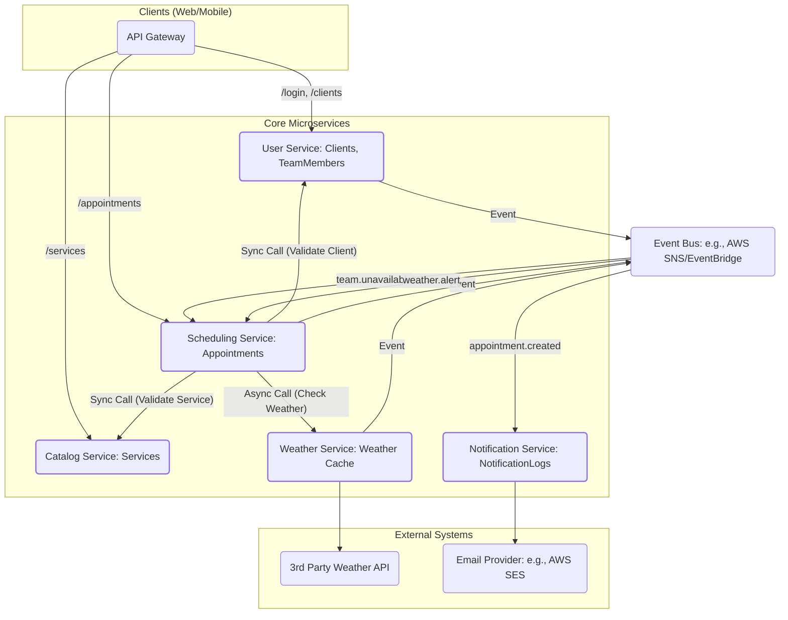

# Scheduling application - Django | DRF
A scheduling application used by landscaping service providers.


## Features

* appointments scheduling
* Service and Catalog management
* 

## Tech Stack

* Python (managed with **uv**)
* Django & Django REST Framework
* django-filters
* PostgreSQL (Docker)

## Repository Layout

```
landscape/        # Django project (settings, urls, wsgi/asgi)
apps/
  scheduling/     # Scheduling domain (models, serializers, filters, API views, urls)
  services/       # Services domain (models, serializers, filters, API views, urls)
  users/          # Users domain (models, serializers, filters, API views, urls)
api/              # Shared API helpers/tests (optional)
docker-compose.yml
pyproject.toml
uv.lock
```

## Prerequisites

* Docker & Docker Compose
* uv ([https://docs.astral.sh/uv/](https://docs.astral.sh/uv/))
* Python 3.12+

## Setup

```bash
# 1) Install dependencies and create the virtual env
uv sync

# 2) Start PostgreSQL
docker compose up -d db

# 3) Environment (create .env at repo root with sample credentials)
cat > .env <<'EOF'
DB_NAME=drf_dev
DB_USER=drf_user
DB_PASSWORD=drf_pass
DB_HOST=127.0.0.1
DB_PORT=5432
DEBUG=1
DJANGO_SECRET_KEY=dev-insecure-key-change-me
EOF

# 4) Apply migrations & run the server
uv run python manage.py migrate
uv run python manage.py createsuperuser
uv run python manage.py runserver
```

* Admin: `http://127.0.0.1:8000/admin/`
* API base (example): `http://127.0.0.1:8000/api/v1/`

## Configuration Notes

* Local apps are imported as `apps.<name>` (e.g., `apps.scheduling`).
* DRF uses **LimitOffsetPagination** (supports `limit` and `offset` query params).
* Filtering and ordering are enabled via DRF backends and `django_filters`.

## API Overview (Examples)

**endpoints sample usage:**

```
GET   /api/v1/<resource>/?limit=20&offset=0&ordering=-created_at&search=<q>
POST  /api/v1/<resource>/
```

**Detail endpoints:**

```
GET    /api/v1/<resource>/{id}/
PATCH  /api/v1/<resource>/{id}/
PUT    /api/v1/<resource>/{id}/
DELETE /api/v1/<resource>/{id}/
```

## Development

```bash
# Format & lint
uv run black .
uv run ruff check .

# Tests
uv run pytest
```

---
Task details and discussions
---

## Part 1

### Task 1
Issues found in the original view `appointment_list_view`
- Iterates over all appointments and queries `service` and `client` details, which causes additional 2 queries per row. Total Queries `~1 + N + N`.
- Printing each row in production is undesirable, and use of print is difficult for implementation.

Optimized query is given below, complete code can be found in [scheduling/views.py](https://github.com/csgcode/landscaping-app/blob/main/apps/scheduling/views.py)

```python
qs = (
        Appointment.objects.select_related("service", "client")
        .values(
            "id",
            "scheduled_date",
            "status",
            "notes",
            "created_at",
            client_name="client__name",
            service_name="service__name",
        )
        .order_by("-scheduled_date", "-id")
    )

```
- Using `select_related` reduces the queries by using a JOIN to fetch the ForeignKey fields required.

### Task 2
Assuming that the existing database update is made to a production application with a large existing database.

The plan is to split the adding of new default field to in 3 stage approach for safer migration.
1. Create a new Field with `null=True`, -- see migration [0002_service_priority.py](https://github.com/csgcode/landscaping-app/blob/main/apps/services/migrations/0002_service_priority.py)
2. Create and run a management command to backfill existing data in batches and update `NULL` values in the table to a default value. This can also be done on low traffic periods -- command [backfill_priority.py](https://github.com/csgcode/landscaping-app/blob/main/apps/services/management/commands/backfill_priority.py)
3. Update the `models.py` to set a default and remove the null=True -- see migration [0003_alter_service_priority.py](https://github.com/csgcode/landscaping-app/blob/main/apps/services/migrations/0003_alter_service_priority.py)

While this 2 stage approach is implemented it is important  to have strong code/admin level checks to set defaults.

### Task 3
Details:

- API List view: [api_views.py](https://github.com/csgcode/landscaping-app/blob/main/apps/scheduling/api_views.py)
- Future enhancements:
  - Add ability to filter with multiple status.


## Part 2

### Architectural Overview

### Service Decomposition.
Proposing the decomposition of the django monolith into microservices which will be able to handle future growth of the application and its development effort.
Main focus of decomposition has been given to make it a simple yet separating it by domain.

1. User Service with Identity management:
  - This services manages all users in the system including Admins, Team Members, Clients, Authentication and permissions.
  - Core service, should be able to handle the huge traffic and scale independently.


2. Catalog Service
  - Includes services, products and pricing details
  - Largely a ready heavy service.

3. Scheduling Service
  - Manages the appointments CRUD, incorporates team availability/assignment workflows.
  - Core service, should be able to handle the huge traffic and scale independently.
  - read and write heavy

4. Notification Service
  - Manages all outbound communications including, sending notifications, emails, sms, alerts to team members and clients.
  - Integrates with 3rd party email/SMS providers ex:Twilio

5. Weather Service
  - Integrates with 3rd party weather APIs and updates about adverse weather conditions and changes in services locations to clients.


#### Justification of the design and planned decomposition
- Each service has been developed with a singular purpose. The Notification Service only sends messages. The Weather service provide and know only about the weather.
- Scheduling and User services are the core and important services in this architecture.

- Planned decomposition:
  - Since the existing django application is running in production with high daily active usage. Ideally we want to migrate to microservices with
  minimal disruptions. Hence planning to migrate to micro-services starting with less critical "low-hanging fruits" services, Notifications and Weather services.
  - Initially we would want the django application to be modularized. Also the core logic can be moved to modular python packages which can be reused in the microservices (optional)
  - Would start decomposition with extracting weather and notification services first. At this time the django monolith will remain but with these services.
  - Now the rest of the services can be split (User service + Catalog) and (Scheduling service). Assuming Catalog and services are linked to Clients and it would still make sense at this point to keep catalog service inside the User service for now. Later if required Catalog service can be extracted, mainly because this is read heavy.


#### Diagram


## Future enhancements
- Since priority field might be used to query often, It is recommended to set the field as `db_index`
- Similarly set `db_index` for all models with appropriate high use fields
- All API related views are currently added to `/<app_name>/api_views.py`, This is assuming normal django views exists and uses `/<app_name>/views.py`


