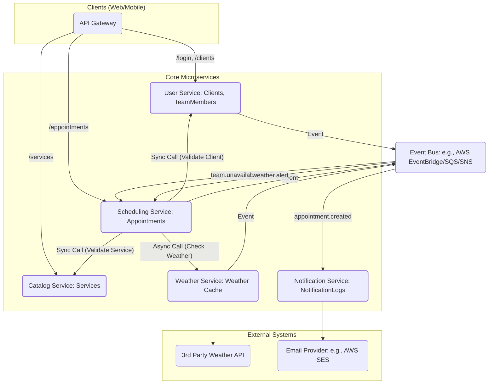

# Scheduling application - Django | DRF | AWS
A scheduling application used by landscaping service providers.


## Features

* Appointments scheduling
* Service and Catalog management
* Team members management
* Invoicing and billing

## Tech Stack

* Python (managed with **uv**)
* Django & Django REST Framework
* django-filters
* PostgreSQL (Docker)

## Repository Layout

```
landscape/        # Django project (settings, urls, wsgi/asgi)
apps/
  scheduling/     # Scheduling domain (models, serializers, filters, API views, urls)
  services/       # Services domain (models, serializers, filters, API views, urls)
  users/          # Users domain (models, serializers, filters, API views, urls)
api/              # Shared API helpers/tests (optional)
docker-compose.yml
pyproject.toml
uv.lock
```

## Prerequisites

* Docker & Docker Compose
* uv ([https://docs.astral.sh/uv/](https://docs.astral.sh/uv/))
* Python 3.12+

## Setup

```bash
# 1) Install dependencies and create the virtual env
uv sync

# 2) Start PostgreSQL
docker compose up -d db

# 3) Environment (create .env at repo root with sample credentials)
cat > .env <<'EOF'
DB_NAME=drf_dev
DB_USER=drf_user
DB_PASSWORD=drf_pass
DB_HOST=127.0.0.1
DB_PORT=5432
DEBUG=1
DJANGO_SECRET_KEY=dev-insecure-key-change-me
EOF

# 4) Apply migrations & run the server
uv run python manage.py migrate
uv run python manage.py createsuperuser
uv run python manage.py runserver
```

* Admin: `http://127.0.0.1:8000/admin/`
* API base (example): `http://127.0.0.1:8000/api/v1/`

## Configuration Notes

* Local apps are imported as `apps.<name>` (e.g., `apps.scheduling`).
* DRF uses **LimitOffsetPagination** (supports `limit` and `offset` query params).
* Filtering and ordering are enabled via DRF backends and `django_filters`.

## API Overview (Examples)

**endpoints sample usage:**

```
GET   /api/v1/appointments/?limit=20&offset=0&ordering=-created_at&search=<q>
POST  /api/v1/appointments/
```

**Detail endpoints:**

```
GET    /api/v1/services/{id}/
PATCH  /api/v1/services/{id}/
PUT    /api/v1/services/{id}/
DELETE /api/v1/services/{id}/
```

## Development

```bash
# Format & lint
uv run black .
uv run ruff check .

# Tests
# Run all tests
uv run pytest

# Run with coverage
uv run pytest --cov=. --cov-report=html --cov-report=term-missing

# Run specific app tests
uv run pytest apps/scheduling/

# Run with verbose output
uv run pytest -v
```


## Deployment
The application uses CircleCI for automated CI/CD to AWS EC2.

## Troubleshooting

**Database connection errors:**
```bash
docker compose ps db  # Check if PostgreSQL is running
docker compose logs db  # Check database logs
```

**Migration conflicts:**
```bash
uv run python manage.py showmigrations
uv run python manage.py migrate --fake-initial
```

**Dependency issues:**
```bash
rm -rf .venv uv.lock
uv sync
```

## Contributing

1. Create a feature branch from `main`
2. Make your changes
3. Run tests and linters: `uv run pytest && uv run black . && uv run ruff check .`
4. Push and create a PR
5. Wait for CI checks to pass
6. Request review from 2 team members
7. Merge to `main` triggers automatic deployment

### CI/CD Pipeline
Pull Requests (non-main branches):

- Run tests with coverage reporting
- Code quality checks (Ruff, Black)
- Security scanning (pip-audit, Bandit)

Main Branch (on merge):

- All checks above, plus:
- Automated deployment to EC2 production server

#### Required CircleCI Environment Variables
Configure in CircleCI project settings:
```sh
EC2_USER              # SSH user for EC2 instance
EC2_HOST              # EC2 instance hostname/IP
EC2_DEPLOY_SCRIPT_PATH # Path to deploy script (default: /srv/landscape/deploy.sh)
COVERAGE_MINIMUM      # Minimum test coverage % (default: 80)
DJANGO_SECRET_KEY     # Django secret
```
Also add EC2 SSH key fingerprint to CircleCI SSH permissions.
---

---
Task details and discussions
---

## Part 1

### Task 1
Issues found in the original view `appointment_list_view`
- Iterates over all appointments and queries `service` and `client` details, which causes additional 2 queries per row. Total Queries `~1 + N + N`.
- Printing each row in production is undesirable, and use of print is difficult for implementation.

Optimized query is given below, complete code can be found in [scheduling/views.py](https://github.com/csgcode/landscaping-app/blob/main/apps/scheduling/views.py)

```python
qs = (
        Appointment.objects.select_related("service", "client")
        .values(
            "id",
            "scheduled_date",
            "status",
            "notes",
            "created_at",
            client_name="client__name",
            service_name="service__name",
        )
        .order_by("-scheduled_date", "-id")
    )

```
- Using `select_related` reduces the queries by using a JOIN to fetch the ForeignKey fields required.

### Task 2
Assuming that the existing database update is made to a production application with a large existing database.

The plan is to split the adding of new default field to in 3 stage approach for safer migration.
1. Create a new Field with `null=True`, -- see migration [0002_service_priority.py](https://github.com/csgcode/landscaping-app/blob/main/apps/services/migrations/0002_service_priority.py)
2. Create and run a management command to backfill existing data in batches and update `NULL` values in the table to a default value. This can also be done on low traffic periods -- command [backfill_priority.py](https://github.com/csgcode/landscaping-app/blob/main/apps/services/management/commands/backfill_priority.py)
3. Update the `models.py` to set a default and remove the null=True -- see migration [0003_alter_service_priority.py](https://github.com/csgcode/landscaping-app/blob/main/apps/services/migrations/0003_alter_service_priority.py)

While this 3 stage approach is implemented it is important  to have strong code/admin level checks to set defaults.

### Task 3
Details:

- API List view: [api_views.py](https://github.com/csgcode/landscaping-app/blob/main/apps/scheduling/api_views.py)
- Future enhancements:
  - Add ability to filter with multiple status.


## Part 2

### Architectural Overview

### Task 1: Service Decomposition.
Proposing the decomposition of the django monolith into microservices which will be able to handle future growth of the application and its development effort.
Main focus of decomposition has been given to make it a simple yet separating it by domain.

1. User Service with Identity management:
  - This services manages all users in the system including Admins, Team Members, Clients, Authentication and permissions.
  - Core service, should be able to handle the huge traffic and scale independently.


2. Catalog Service
  - Includes services, products and pricing details
  - Largely a ready heavy service.

3. Scheduling Service
  - Manages the appointments CRUD, incorporates team availability/assignment workflows.
  - Core service, should be able to handle the huge traffic and scale independently.
  - read and write heavy

4. Notification Service
  - Manages all outbound communications including, sending notifications, emails, sms, alerts to team members and clients.
  - Integrates with 3rd party email/SMS providers ex:Twilio

5. Weather Service
  - Integrates with 3rd party weather APIs and updates about adverse weather conditions and changes in services locations to clients.


#### Justification of the design and planned decomposition
- Each service has been developed with a singular purpose. The Notification Service only sends messages. The Weather service provide and know only about the weather.
- Scheduling and User services are the core and important services in this architecture.
- Independent Scalability: The Catalog Service (read-heavy) can be scaled by adding database replicas. The Scheduling Service (write-heavy, complex logic) can be scaled by adding more compute instances. This is more cost-effective than scaling a monolith.
- Resilience: If the Weather Service fails, clients can still book appointments (perhaps with a warning). If the Notification Service fails, the AppointmentCreated events will queue up and be processed when it recovers, ensuring no notifications are lost.
- All producers use the outbox pattern. all consumers perform idempotent processing using event.id (DynamoDB/SQL unique). SQS retries + DLQs are enabled. (optional)
- Security consideration: Most events carrys IDs only to minimize PII on the Buses. For accessing the PII the Services, like Notification service, fetches required details from the User Service

- Planned decomposition:
  - Since the existing django application is running in production with high daily active usage. Ideally we want to migrate to microservices with minimal disruptions. Hence planning to migrate to micro-services starting with less critical "low-hanging fruits" services, Notifications and Weather services.
  - Initially we would want the django application to be modularized. Additionally, the core logic can be moved to modular python packages which can be reused in the microservices (optional)
  - Would start decomposition with extracting weather and notification services first. At this time the django monolith will remain but without these services.
  - Now the rest of the services can be split (User service + Catalog) and (Scheduling service). Assuming Catalog and services are linked to Clients and it would still make sense at this point to keep catalog service inside the User service for now. Later if required Catalog service can be extracted, mainly because this is primarily read heavy and would make sense to keep it separate from User service.


#### Architectural overview diagram


### Task 2: Event driven Architecture
The following describes what happens between services for a specific scenarios.

Few design decisions:

- All events have a common base structure:
```json
{
  "id": "01HF5V0E6WN2Z2G4X0N8E1T7DW",             // event id
  "type": "…",                                   // event name + version
  "source": "scheduling",                        // producing service
  "occurred_at": "2025-10-30T09:12:11Z",          // datetime
  "correlation_id": "req-7b3cXXX",                // tracing
  "data": { /* payload */ }
}
```
- All events have version numbers, breaking changes create .v2 events. `.v1` is kept until consumers migrate.

1. When an appointment is created:

  Producer: Scheduling service
  Event: `scheduling.appointment.created.v1`
  
  Payload:
  ```json
  {
  "id": "apt_987",
  "client": 456,
  "service": 23,
  "scheduled_date": "2025-11-02T10:00:00Z",
  "status": "scheduled",
  "notes": "Gate A1 pass code 1234",
  "created_at": "2025-10-30T09:12:10Z"
  }
  ```
  Consumers: 
  - Notification Service -> sends confirmation (email/SMS), 
  - Weather Service -> schedules/does forecast check for the client’s address at scheduled_date.
  
2. Weather conditions change
  Weather service polls external APIs to get weather updates, and emits events on adverse weather.

  Producer: Weather Service
  Event: `weather.alert.updated.v1`

  Payload:
  ```json
  {
  "severity": "high",
  "reason": "heavy_rain",
  "valid_from": "2025-11-02T08:00:00Z",
  "valid_to": "2025-11-02T12:00:00Z",
  "area": ["SW1A 1AA"]
  }
```

  Consumers:
  - Scheduling Service -> Finds overlapping Appointments whose Clients are in the affected area, flags services “at risk” for the area and date. Which can then trigger another events for Notifications (optional). Scheduling service can suggest alternate days as well. [Marketed as AI feature]
  - Notification Service -> Optionally send notifications if the client has subscribed to an area weather event.

3. A team member becomes unavailable
  
  Producer: User Service
  Event: `user.team_member.availability.changed.v1`
  
  Payload:

  ```json
  {
  "id": 321,
  "user": 78,
  "specialties": [23, 41],
  "is_available": false
  }
```

  Consumers:
  - Scheduling Service -> finds upcoming appointments assigned to this team member. Creates a Notification with effected services and clients.
  Tries auto reassignment [Marketed as AI feature]
  - Notification Service -> Notifies the Client/Customer about upcoming reassignment tasks.


## Future enhancements
- Since priority field might be used to query often, It is recommended to set the field as `db_index`
- Similarly set `db_index` for all models with appropriate high use fields
- All API related views are currently added to `/<app_name>/api_views.py`, This is assuming normal django views exists and uses `/<app_name>/views.py`
- Add `modified_at` timestamp to all models.py to track all updates


